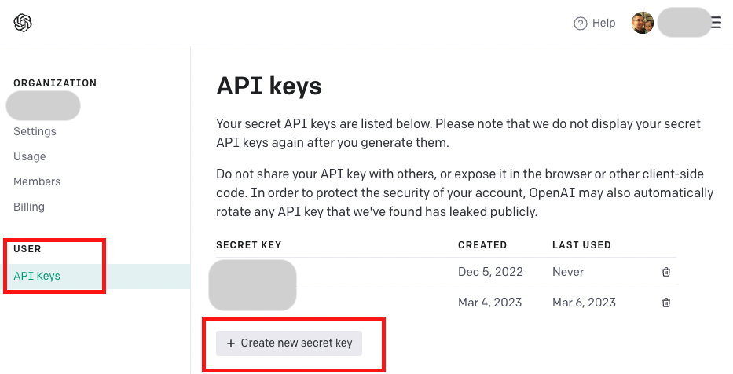

# CodeGPT

[](https://github.com/appleboy/CodeGPT/actions/workflows/testing.yml)
[](https://codecov.io/gh/appleboy/CodeGPT)
[](https://goreportcard.com/report/github.com/appleboy/CodeGPT)


A CLI written in [Golang](https://go.dev) that writes your git commit messages for you with ChatGPT AI (`gpt-3.5-turbo` model) and install a [git prepare-commit-msg hook](https://git-scm.com/docs/githooks) automatically.

## Installation

The pre-compiled binaries can be downloaded from [release page](https://github.com/appleboy/CodeGPT/releases).

On linux AMD64

```sh
wget -c https://github.com/appleboy/CodeGPT/releases/download/v0.0.3/CodeGPT-0.0.3-linux-amd64 -O codegpt
```

On macOS (Intel amd64)

```sh
wget -c https://github.com/appleboy/CodeGPT/releases/download/v0.0.3/CodeGPT-0.0.3-darwin-amd64 -O codegpt
```

On macOS (Apple arm64)

```sh
wget -c https://github.com/appleboy/CodeGPT/releases/download/v0.0.3/CodeGPT-0.0.3-darwin-arm64 -O codegpt
```

On Windows (AMD64)

```sh
wget -c https://github.com/appleboy/CodeGPT/releases/download/v0.0.3/CodeGPT-0.0.3-windows-amd64.exe -O codegpt.exe
```

Change the binary permission to `755` and move to system bin directory. Try the `codegpt` command as below

```sh
$ codegpt version
version: v0.0.3 commit: 415c8a1
```

## Setup

Please set up your OpenAI API Key first. You can create a new API Key from the [OpenAI Platform](https://platform.openai.com/account/api-keys).



```sh
codegpt config set openai.api_key sk-xxxxxxx
```

This will create a `.codegpt.yaml` file in your home directory ($HOME/.config/codegpt/.codegpt.yaml).

## Usage

There are two ways to generate commit message from `codegpt` command. The first is `CLI mode` and the second is `Git Hook`.

### CLI mode

You can call `codegpt` directly to generate a commit message for your staged changes:

```sh
git add <files...>
codegpt commit
```

You will see the commit message as below

```sh
Summarize the commit message use gpt-3.5-turbo model
We are trying to summarize a git diff
We are trying to summarize a title for pull request
================Commit Summary====================

Add OpenAI integration and CLI usage instructions

- Add download links for pre-compiled binaries for various platforms
- Add instructions for setting up OpenAI API key
- Add CLI usage instructions for generating commit messages with `codegpt`
- Add references to OpenAI Chat completions documentation and introducing ChatGPT and Whisper APIs

==================================================
Write the commit message to .git/COMMIT_EDITMSG file
```

or translate all given git commit message to another language (`Traditional Chinese`, `Simplified Chinese` or `Japanese`)

```sh
codegpt commit --lang zh-tw
```

See the following result:

```sh
Summarize the commit message use gpt-3.5-turbo model
We are trying to summarize a git diff
We are trying to summarize a title for pull request
We are trying to translate a git commit message to Traditional Chineselanguage
================Commit Summary====================
增加發布頁面改進和CLI模式說明。

- 在發布頁面上增加了不同系統的預編譯二進制文件。
- 提供設置OpenAI API密鑰的說明。
- 提供使用CLI模式生成暫存更改的提交消息的說明。

==================================================
Write the commit message to .git/COMMIT_EDITMSG file
```

### Git hook

You can also integrate `codegpt` with Git via the prepare-commit-msg hook. This lets you use Git like you normally would, and edit the commit message before committing.

#### Install

In the Git repository you want to install the hook in:

```sh
codegpt hook install
```

#### Uninstall

In the Git repository you want to uninstall the hook from:

```sh
codegpt hook uninstall
```

After installtation, stage your files and commit:

```sh
git add <files...>
git commit
```

`codegpt` will generate the commit message for you and pass it back to Git. Git will open it with the configured editor for you to review/edit it. Then save and close the editor to commit!

```sh
$ git commimt
Summarize the commit message use gpt-3.5-turbo model
We are trying to summarize a git diff
We are trying to summarize a title for pull request
================Commit Summary====================

Improve user experience and documentation for OpenAI tools

- Add download links for pre-compiled binaries
- Include instructions for setting up OpenAI API key
- Add a CLI mode for generating commit messages
- Provide references for OpenAI Chat completions and ChatGPT/Whisper APIs

==================================================
Write the commit message to .git/COMMIT_EDITMSG file
[main 6a9e879] Improve user experience and documentation for OpenAI tools
 1 file changed, 56 insertions(+)
```

## Reference

* [OpenAI Chat completions documentation](https://platform.openai.com/docs/guides/chat).
* [Introducing ChatGPT and Whisper APIs](https://openai.com/blog/introducing-chatgpt-and-whisper-apis)
